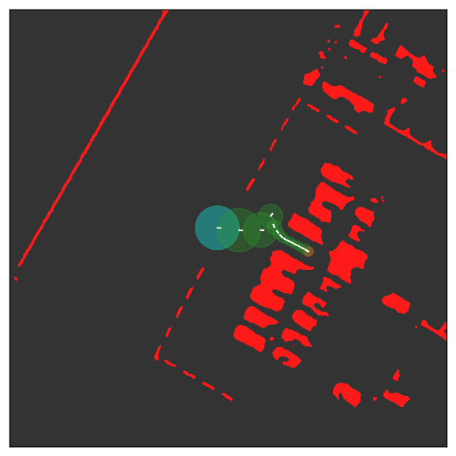
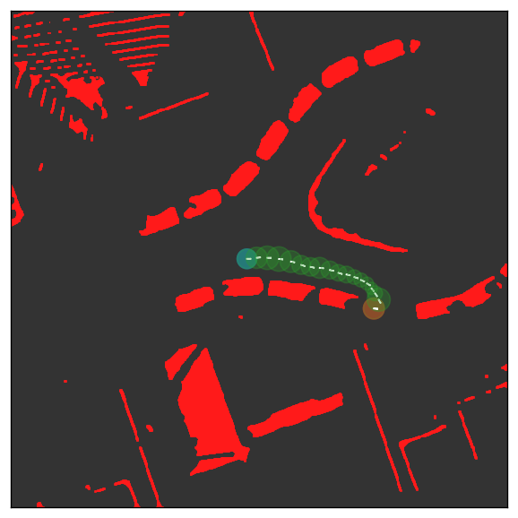
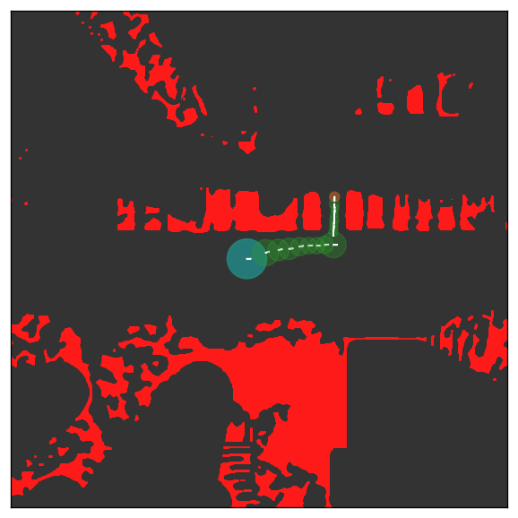

*Orientation‑Aware Space Exploration for autonomous‑vehicle motion planning*

pyHSP is a **Python 3** implementation of the Orientation‑Aware Space
Exploration (**OSE**) planner — a circle‑expansion Hybrid A* algorithm
for curvature‑bounded vehicles.
This repository hosts the original prototype that,
after a full redesign, evolved into the global path‑planner powering the TUfast Eco‑Team
autonomous prototype vehicles **muc022** and **muc023**.

This repository is built upon the Python 2 code by [Gabel Liemann](https://github.com/liespace/pyHSP),
which implemented the Orientation-Aware Space Exploration planner described in [^1] and referenced in [^2].


## Features

- 🧭 **OSE algorithm** – orientation‑aware Hybrid A* with circle templates.
- ⚡ **Numba‑accelerated kernels** – fast clearance and neighbour generation.
- 🖼️ **Built‑in visualiser** – Matplotlib demo scenes under `tests/`.
- 🐍 **Modern Python 3.12** – PEP484 typing, docstrings, `black` formatted.
- ✅ **Regression tests** – quick end‑to‑end checks.

## Examples

|  |  |  |  |
|---|---|---|---|

> Result images generated with `tests/test_driver.py`.


## Quick Start

```bash
# clone & install in editable mode
git clone https://github.com/<your‑org>/pyHSP.git
cd pyHSP
pip install -e .

# run the demo visualiser
python tests/test.py --show
```


## References

[^1]: Chen, Chao, Markus Rickert, and Alois Knoll. "Path planning with orientation-aware space exploration guided heuristic search for autonomous parking and maneuvering." 2015 IEEE Intelligent Vehicles Symposium (IV). IEEE, 2015.

[^2]: Banzhaf, Holger, et al. "Learning to predict ego-vehicle poses for sampling-based nonholonomic motion planning." IEEE Robotics and Automation Letters 4.2 (2019): 1053-1060.